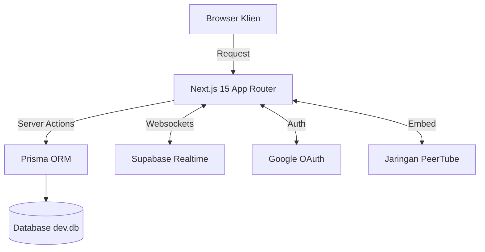

<div align="center">
  
  <h1>Aiuiso Video Platform</h1>
  <p><strong>Platform Streaming Video Cerdas Generasi Berikutnya</strong></p>

  <p>
    
    
    
    
    
  </p>
</div>

---

Aiuiso adalah platform VOD (Video on Demand) terdesentralisasi modern yang dibangun menggunakan arsitektur _App Router_ Next.js 15. Proyek ini memadukan kemudahan pemutaran streaming skala besar (PeerTube & sumber eksternal) dengan pengalaman antarmuka yang sangat estetik bergaya _glassmorphism_.

## ✨ Fitur Unggulan (Flagship Features)

- **🧠 Pencarian Semantik AI & Rekomendasi**: Lupakan pencarian kata kunci kaku! Aplikasi ini dibekali kecerdasan buatan untuk memahami *konteks* pencarian Anda (Natural Language Processing).
- **🌐 Streaming Multi-Sumber & Terdesentralisasi**: Integrasi mulus dengan jaringan **PeerTube** dan sumber video eksternal lainnya. Mengurangi beban server utama (bandwidth offloading) sekaligus menyajikan pemutaran video tanpa jeda (*buffer-free*).
- **⚡ Navigasi Secepat Kilat (Zero-Loading)**: Dibangun dengan arsitektur **React Server Components (RSC)** Next.js 15. Halaman dirender langsung dari server, menghasilkan transisi super instan tanpa *spinner* pemuatan lambat.
- **🌍 Lokalisasi Global Otomatis (Smart Routing)**: Sistem pendeteksi geolokasi IP pintar (tanpa membebani middleware) yang akan otomatis menyajikan antarmuka dalam **9 pilihan bahasa** menyesuaikan negara asal penonton.
- **💬 Ekosistem Interaktif Real-time**: Komentar, diskusi, dan indikator *Live Streaming* disiarkan secara *real-time* dengan latensi sangat rendah, ditenagai langsung oleh protokol WebSocket **Supabase**.
- **📈 Dasbor Admin & Analitik Pendapatan Komprehensif**: Kendali absolut atas konten Anda! Sistem manajemen moderasi cerdas, pengelolaan tag, blokir regional, hingga visualisasi pendapatan iklan secara grafis.
- **⏱️ AI Smart Chapters (Penanda Bab Otomatis)**: Memanfaatkan AI untuk menganalisis transkrip isi video lalu otomatis menyisipkan "Bab" (Timeline Markers) di *progress bar* pemutar. Penonton bisa langsung melompat ke segmen paling relevan.
- **📱 Shorts / Reels Feed (Infinite Vertical Scroll)**: Segmen khusus penayangan klip-klip video pendek secara vertikal yang bisa digulir tanpa batas untuk meningkatkan matriks retensi audiens ke level maksimal.

## 🗺️ Peta Jalan & Rencana Mendatang (Roadmap)
Kami tidak berhenti di sini! Berikut adalah beberapa fitur canggih yang sedang dalam tahap perencanaan:
- **🍿 Watch Party Real-time**: Menonton video secara tersinkronisasi bersama teman-teman dalam ruangan privat yang dilengkapi *live chat*.
- **📱 PWA & Mode Offline**: Aplikasi dapat diunduh (PWA) untuk menonton video secara *offline*.
- **📝 AI Auto-Subtitle**: Pembuatan teks terjemahan tertutup (CC) otomatis dengan dukungan terjemahan multi-bahasa.
- **💰 Sistem Tipping Kreator (Web3/Stripe)**: Dukungan langsung dari penonton ke kreator lewat Super Chat atau koin.
- **☁️ Adaptive Bitrate Caching (HLS/DASH)**: Kualitas video yang menyesuaikan secara cerdas berdasarkan kecepatan internet pengguna untuk menghindari *buffering*.
- **🛡️ Filter AI Visual (Auto-NSFW)**: Mesin pendeteksi gambar otomatis untuk menahan konten ilegal sebelum dipublikasikan.

## 🏗 Arsitektur Sistem



## 🚀 Memulai (Getting Started)

Proyek ini dipacu oleh `bun` untuk performa instalasi dan _runtime_ maksimal. Pastikan Anda telah [menginstal bun](https://bun.sh/) di sistem Anda.

### 1. Kloning & Instalasi
```bash
git clone https://github.com/your-username/aiuiso-next.git
cd aiuiso-next
bun install
```

### 2. Variabel Lingkungan
Gandakan file pengaturan menjadi `.env.local`:
```bash
cp .env.example .env.local
```
Isi variabel yang diwajibkan, khususnya `AUTH_SECRET` (buat string acak 32 karakter) dan `DATABASE_URL`.

### 3. Inisialisasi Database
Kami menggunakan SQLite untuk mempermudah _development lokal_:
```bash
bunx prisma db push
bunx prisma generate
```

### 4. Jalankan Server
```bash
bun run dev
```
Buka browser di [http://localhost:3000](http://localhost:3000). Aplikasi akan otomatis merutekan Anda ke lokal ID/EN Anda berdasarkan IP lokal.

## 📁 Struktur Proyek (Ringkas)

- `/src/app/[locale]` - Zona Publik (Beranda, Pemutar, Pencarian, Login).
- `/src/app/[locale]/admin` - Zona Administrasi (Dasbor, Tabel Data, Manajemen).
- `/src/app/api` - *Route Handlers* (Webhooks, Pencarian AI, Sinkronisasi Cron).
- `/src/components/features` - Kumpulan UI spesifik (Pemutar Video, Komentar, Dasbor).
- `/src/components/ui` - Basis komponen Shadcn UI.

## 🛡️ CI/CD & Deployment

Aplikasi ini dilengkapi dengan **GitHub Actions** yang secara otomatis melakukan kompilasi TypeScript (`tsc`) dan Next.js Build pada setiap _Pull Request_ atau integrasi ke _branch_ utama. 

Aplikasi sangat direkomendasikan untuk disebarkan pada [Vercel](https://vercel.com). Tidak ada konfigurasi server kustom yang rumit yang dibutuhkan.

---

<div align="center">
  Dibuat dengan ❤️ oleh Tim Aiuiso • 2026
</div>
